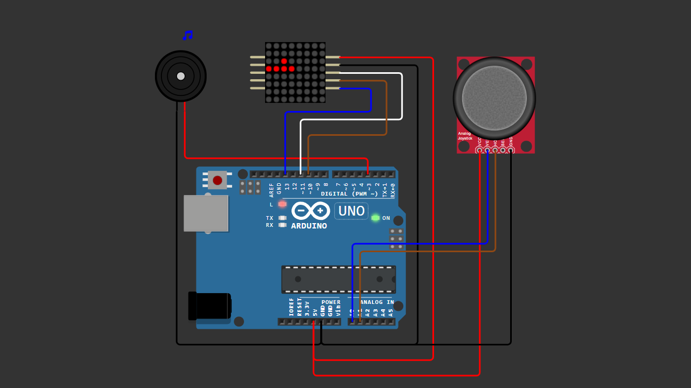

# Arduino Snake Game (Nokia Style)

A beginner-friendly Arduino project that recreates the classic Snake game using an 8x8 MAX7219 LED Matrix, controlled by a KY-023 joystick, and enhanced with buzzer sound effects.

This project demonstrates basic game logic, input handling, and LED matrix control in a fun and interactive way.

---

## 📌 Project Overview

This project is inspired by the classic Snake game from old Nokia phones.

The snake moves across an 8x8 grid, controlled by a joystick. The goal is to eat food, grow longer, and avoid colliding with itself.

Sound effects are added to enhance the gameplay experience:
- Movement beep for feedback  
- Eating sound for reward  
- Game over sound with animation  

This project is designed to be simple enough for beginners while still being fun and expandable.

---

## 🧰 Components Required

- Arduino Uno / Nano  
- MAX7219 8x8 LED Matrix  
- KY-023 Joystick Module  
- Buzzer (Active or Passive)  
- Jumper Wires  
- Breadboard (optional)  

---

## 🔌 Wiring Connections

| Component            | Arduino |
|---------------------|--------|
| MAX7219 VCC         | 5V     |
| MAX7219 GND         | GND    |
| MAX7219 DIN         | D11    |
| MAX7219 CS          | D10    |
| MAX7219 CLK         | D13    |
| Joystick VRx        | A0     |
| Joystick VRy        | A1     |
| Joystick SW         | D2 (optional) |
| Joystick VCC        | 5V     |
| Joystick GND        | GND    |
| Buzzer (+)          | D3     |
| Buzzer (-)          | GND    |

---

## 📷 Wiring Diagram



> Make sure your wiring matches the diagram above before uploading the code.

---

## 💻 Arduino Code

You can download the Arduino sketch here:

[Download Arduino Code](Arduino_Snake_Game.ino)

Or open the `.ino` file directly inside this repository.

---

## 🚀 Getting Started

1. Connect all components according to the wiring table.
2. Upload the provided Arduino sketch.
3. Power the Arduino.
4. Use the joystick to control the snake.
5. Eat food and avoid hitting yourself!

---

## 🎮 How It Works

- The snake moves continuously on the LED matrix  
- Use the joystick to change direction  
- Eating food increases the snake length  
- The game ends when the snake hits itself  
- A game over animation and sound will play  

---

## 🔊 Sound Effects

This project includes multiple sound effects:

- Movement → short beep  
- Eat food → higher tone reward  
- Game over → descending tone  

---

## ⚙️ Joystick Direction Setup

If your joystick direction feels reversed, you can adjust it easily:

```cpp
int invertX = 1;   // or -1
int invertY = 1;   // or -1
